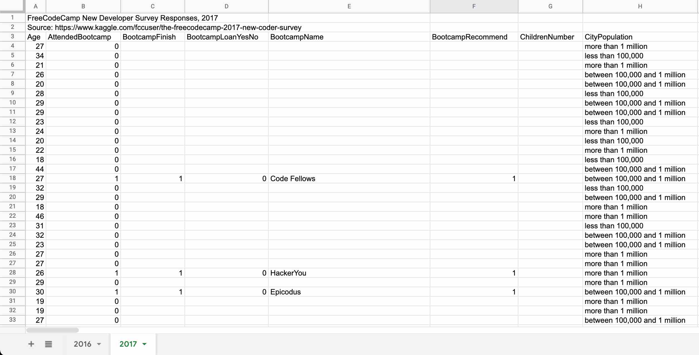
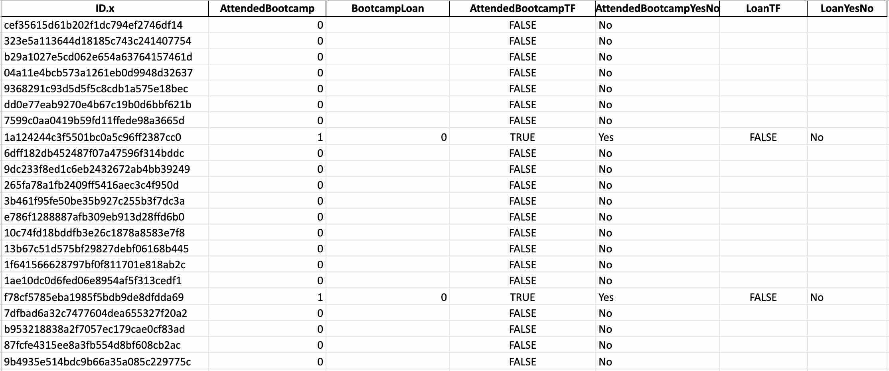
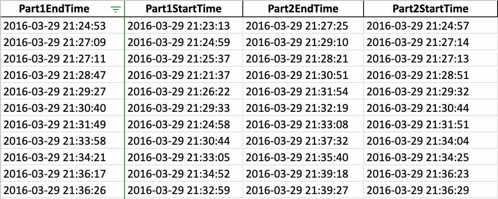

# Streamlined Data Ingestion with Pandas

*This course is all about acquiring data form various sources such as spreadsheet, database, API... for analysis. We will use pandas to build pipeline to import data kept in common storage format.*

## Importing Data from Flat Files

### Introduction to flat files

Flat files are unformatted text files commonly used for data exchanges. Spreadsheets and databases use flat files to export and exchange data. In flat files a line represent a row and comma separated values are column values. The separator is called a delimiter. Other delimiters can be used to specify column values. 

Pandas a special tabular data structure to hold two-dimensional datas. It is called DataFrame. DataFrame has rows and columns. Pandas provide a functionality to load flat files.

```python
import pandas as pd

df = pd.read_csv('path_to_csv/data.csv') # read csv as a dataframe
df.head(4) # print top 4 rows
```
*Streamlined Data Ingestion with Pandas*


To read flat files with delimiter other than `,`

```python
import pandas as pd

df = pd.read_csv('path_to_csv/data.tsv', sep='\t') # read flat file separated by tabs
df.head(4) # print top 4 rows
```
*Streamlined Data Ingestion with Pandas*

See [read_csv](https://pandas.pydata.org/docs/reference/api/pandas.read_csv.html) to get possible values of sep.

### Modifying flat file imports

When working with a big flat file you might want to take portion of the data and make it easier to work with. This will reduce your memory usage and make the data easier to scan through.

We can segment the data vertical by specifying column names or horizontally by specifying rows.

Let’s use [Vermont tax return data by ZIP code](https://assets.datacamp.com/production/repositories/4412/datasets/61bb27bf939aac4344d4f446ce6da1d1bf534174/vt_tax_data_2016.csv) and take only portion of it we want to work with.

 

```python
tax_data = pd.read_csv('vt_tax_data_2016.csv')
print(tax_data.shape)

# output
(1476, 147)
```
*Read and print dimension of the data*

This data 1476 x 147 which a small data by today’s standard. 147 columns can be a lot for us to work with this data so what we want to do is take only the columns we want to work with.

**Limiting Columns**

To limit columns we use `usecols` keyword argument. It accepts a list of column numbers or names, or callable filter function.


```python
col_names = ['STATEFIPS', 'STATE', 'zipcode', 'agi_stub']
col_nums = [0, 1, 2, 3]
col_2n = lambda col : len(col) == 2
# Load columns by names
tax_data_v1 = pd.read_csv('vt_tax_data_2016.csv', usecols=col_names)
# Load columns by number
tax_data_v2 = pd.read_csv('vt_tax_data_2016.csv', usecols=col_nums)
# Load columns by filter callback function
tax_data_v3 = pd.read_csv('vt_tax_data_2016.csv', usecols=col_2n)
```
*Read and print dimension of the data*

To load columns by name we have to know column names in advance. The order of names or numbers is ignored. The filter function only loads columns with are two character long. We can do more complex filtering on column names to select specific columns.

**Limiting Rows**

We have seen how to load selected columns, let’s see how we can select specific rows.

To select rows use use `nrows`keyword argument. It takes an integer and it takes the top n rows. It can be useful to read piece of a large file. `nrows` comes handy when used with `skiprows` . `skiprows` accepts row numbers, number of lines to skip or a callback function.

If using `skiprows` will skip the column row, we have to specify `header=None` so pandas know there are no columns.

```python
# read first 100 rows
tax_data_first100 = pd.read_csv('vt_tax_data_2016.csv', nrows=100)
# read the next 100 rows after skipping 100 rows
tax_data_next100 = pd.read_csv('vt_tax_data_2016.csv',
				nrows=100,
				skiprows=100,
				header=None)
```
*Limit rows using `nrows` and `skiprows`*

To assign a column name we can use `names` argument. It accepts list of column names. The list should contain all column names. The usual way to get this is to first have the file loaded and extract column names from it using `list()` built-in function.

```python
# assign column name
col_names = list(tax_data_first100)
tax_data_next100_with_col = pd.read_csv('vt_tax_data_2016.csv',																	nrows=100,
					skiprows=100,
					header=None,
					names=col_names)
```
*Assigning column name of load*

We can use a filter function like we did with `usecols` to have a custom filter. The below code reads the top 100 rows that are not multiple of 3. It skips rows that are multiple of 3 like 3, 6, 9,... until the total number of rows reach 100.

```python
# read first 100 rows that are not multiple of 3 
tax_data_mod3 = pd.read_csv('vt_tax_data_2016.csv',
			    nrows=100,
			    skiprows=lambda row : r % 3)
```
*Applying callback of `skiprows`*

### Handling errors and missing data

Importing data with the ways we saw above is enough to work on the data if the data is in great shape. But how to handle when the data is missing values or the is error while importing due to corrupted rows.

Common flat file import issues are:

- Column data types are wrong
- Missing value with custom designators
- Corrupted rows in file

**Specifying data types**

Pandas automatically infer column data types. Some times it infer incorrectly. When this happen we can manually give data type for columns at the time of loading.

```python
tax_data = pd.read_csv('vt_tax_data_2016.csv')
print(tax_data.dtypes)

#output
STATEFIPS     int64
STATE        object
zipcode       int64 # zipcode is integer type
agi_stub      int64
N1            int64
              ...  
A85300        int64
N11901        int64
A11901        int64
N11902        int64
A11902        int64
```
*Print out dtypes of a DataFrame*

Pandas infer data type of *zipcode* to be an integer. *zipcode* should be a string type. We can use `dtype` to tell pandas columns data type. It accept a dictionary of column names with their corresponding data type.

```python
# tell pandas the data type for zipcode column is string
tax_data = pd.read_csv('vt_tax_data_2016.csv', dtype={'zipcode': str})
print(tax_data.dtypes)

#output
STATEFIPS     int64
STATE        object
zipcode      object # zipcode is object type, which is pandas' counterpart to python str
agi_stub      int64
N1            int64
              ...  
A85300        int64
N11901        int64
A11901        int64
N11902        int64
A11902        int64
```
*Set data type of columns with dtype*

**Customizing missing data values**

Pandas does a good job at tracing missing values. They are give value of NaN. Imputing this missing values easy in pandas but what happens when missing values have already been imputed with dummy datas?

```python
# select and print only *STATEFIPS*, *STATE*, *zipcode*, *agi_stub* columns
print(tax_data[['STATEFIPS', 'STATE', 'zipcode', 'agi_stub']])

# output
     STATEFIPS	STATE	zipcode	agi_stub
0	          50	   VT	      0	       1 # dummy zipcode value
1	          50	   VT	      0	       2
2	          50	   VT	      0	       3
3	          50	   VT	      0	       4
4	          50	   VT	      0	       5
...	       ...	  ...	   ...	      ...
1471	          50	   VT	  99999	       2
1472	          50	   VT	  99999	       3
1473	          50	   VT	  99999	       4
1474	          50	   VT	  99999	       5
1475	          50	   VT	  99999	       6
```
*Explore for dummy values in tax_data*

If we know the values of the dummy datas then we can let pandas know the dummy datas are missing values and to be treated as NaN. Pandas will load the dummy datas as NaN values.

Here *zipcode* with `0` values are missing values. We know `0` is a dummy value, a placeholder for missing values. By using `na_values` argument we can tell pandas `0` is a dummy data in *zipcode* column and all `0` values in *zipcode* should be convert to NaN. It accept a dictionary of column names with dummy values.

```python
# all 0 values in *zipcode should* be NaN
tax_data = pd.read_csv('vt_tax_data_2016.csv',
		       dtype={'zipcode': str},
		       na_values={'zipcode': 0})

print(tax_data[['STATEFIPS', 'STATE', 'zipcode', 'agi_stub']])

# output
     STATEFIPS	STATE	zipcode	agi_stub
0	          50	   VT	    NaN	       1 # dummy value replaced by NaN
1	          50	   VT	    NaN	       2
2	          50	   VT	    NaN	       3
3	          50	   VT	    NaN	       4
4	          50	   VT	    NaN	       5
...	         ...	  ...	   ...	      ...
1471	          50	   VT	  99999	       2
1472	          50	   VT	  99999	       3
1473	          50	   VT	  99999	       4
1474	          50	   VT	  99999	       5
1475	          50	   VT	  99999	       6
```
*Impute dummy values in zipcode with NaN values*

**Lines with errors**

The data flat file might contain a missing delimiter or skip a column value in a row. Such errors will corrupt the file and pandas will raise a *ParserError* exception. Pandas has an option to skip rows where the data is corrupted and read only rows with correct format.

- `error_bad_lines` argument takes boolean and skip unparseable records.
- `warn_bad_lines` is another useful argument that takes boolean wether to show message when records are skipped.

```python
# skips error records and show a message why
tax_data = pd.read_csv('vt_tax_data_2016.csv',
		       error_bad_lines=False,
		       warn_bad_lines=True)
```
*Skip corrupted records when loading a csv*

## **Importing Data From Excel Files**

### Introduction to spreadsheets

Spreadsheets or excels are one of the most used formats to store data. They are beings used everywhere. Data is stored tabular cells arranged in rows and columns. Spreadsheets can have formatting and formula to automatically update values. Multiple spreadsheets can exist in a workbook.

Using `read_excel()` we can load spreadsheet to a pandas DataFrame. `read_excel()` is very similar with `read_csv()`. They share most of the argument keywords. 

If it is your first time using `read_excel()`, you might face ImportError exception.

```python
ImportError: Missing optional dependency 'openpyxl'.  Use pip or conda to install openpyxl.
```

To fix this go to your terminal and run the code below. This install *openpyxl*

```bash
pip install openpyxl
```

Let’s load [fcc-new-coder-survey](https://assets.datacamp.com/production/repositories/4412/datasets/fdb113aa942a0e0ad5c155b2f04784886f0038c9/fcc-new-coder-survey.xlsx) excel and see the output

```python
# load an excel file
survey_data = pd.read_excel('fcc-new-coder-survey.xlsx')
print(survey_data.head())

# output
           FreeCodeCamp New Developer Survey Responses, 2016	       Unnamed: 1	    Unnamed: 2	       Unnamed: 3
0	   Source: https://www.kaggle.com/freecodecamp/20...	              NaN	           NaN	              NaN
1	                                                 Age	 AttendedBootcamp	BootcampFinish	BootcampLoanYesNo
2	                                                  28	                0	           NaN	              NaN
3	                                                  22	                0	           NaN	              NaN
4	                                                  19	                0	           NaN	              NaN
...	                                                 ...	              ...	           ...	              ...
997	                                                  35	                0	           NaN	              NaN
998	                                                  19	                0	           NaN	              NaN
999	                                                  25	                0	           NaN	              NaN
1000	                                                  28	                0	           NaN	              NaN
1001	                                                  39	                0	           NaN	              NaN
```

**Loading selected columns and rows**

Spreadsheets can be structured in whatever way a user wants. Row and columns can be merged together (usually to hold metadata) which disturbs the tabular format. Loading such excels in pandas will not result what you might expect. Like the above spreadsheet output. 



If you look at the first row, it contains a title and second row contains source link. We need to remove the rows for pandas to correctly parse and load the data in this spreadsheet. Like `read_csv()`, `read_excel()`has `nrows`, `skiprows`, `usecols`... In addition to column positions and names `usecols` accepts letters (e.g “A:P”).

```python
# load an excel file
survey_data = pd.read_excel('fcc-new-coder-survey.xlsx',
		 	    skiprows=2,         # skpi the first two rows
			    usecols="W:Z, AR")  # read columns from W to Z and AR
print(survey_data.head())

# output
        CommuteTime            CountryCitizen               CountryLive                    EmploymentField	  Income
0	        5.0  United States of America  United States of America  office and administrative support	  32000.0
1	        0.0  United States of America  United States of America                  food and beverage        15000.0
2	        5.0  United States of America  United States of America                            finance	  48000.0
3	        0.0  United States of America  United States of America                          education	   6000.0
```

### ****Getting data from multiple worksheets****

Spreadsheet and excel are often used exchangeable although excel can mean a workbook with multiple spreadsheets. Excel can contain tabular data, graphs or metadata. We will focus on excel with tabular data. To select which sheets to load we use `sheet_name` keyword argument. It accept sheet name, (zero-indexed) position argument or mixture of both. By default it is set to 0 which refers to the first sheet.

Our fcc-new-coder-survey.xlsx excel file has two sheets. 2016 and 2017

```python
# load the second sheet by index position
survey_data_sheet2 = pd.read_excel('fcc-new-coder-survey.xlsx', sheet_name=1)
# load the second sheet by name
survey_data_2017 = pd.read_excel('fcc-new-coder-survey.xlsx', sheet_name='2017')

print(survey_data_sheet2.equals(survey_data_2017))

# output
True
```

**Loading all sheets**

Passing sheet_name=None will load all sheet.

```python
# load all sheets
survey_data = pd.read_excel('fcc-new-coder-survey.xlsx', sheet_name=None)

print(type(survey_data))

# output
dict

survay_data_2016 = survay_data['2016']
survay_data_2017 = survay_data['2017']

print(type(survay_data_2016))
print(type(survay_data_2017))

# output
<class 'pandas.core.frame.DataFrame'>
<class 'pandas.core.frame.DataFrame'>
```

Any argument passed will be apply on each sheet load. To put the sheet together, we loop through the dict and merge the DataFrame to a common variable. In our case the two sheet has similar structure(have the same columns) so we don’t have to make them the same structure to put them together. 

```python
# load all sheets, skip the first 2 rows 
survey_data = pd.read_excel('fcc-new-coder-survey.xlsx',
                            skiprows=2,
                            sheet_name=None)

all_survey = pd.DataFrame()
# iterate thorugh dataframes in a dictionary
for sheet_name, frame in survey_data.items(): 
		# add a Year column so we know which year data is from
		frame['Year'] = sheet_name
		# add all frames to all_survey
		all_survey = all_survey.append(frame)

# get unique values in data
print(all_survey.Year.unique())

# output
['2016', '2017']
```

### ****Modifying imports: true/false data****

Booleans are true / false values. They only have two values. They come handy when dealing with tasks such as filtering. Pandas treat booleans as float values. True is 1 & false is 0. Booleans can come in different format from different sources. Let’s look at a portion of fcc survey booleans data.



The first column is id column. **AttendedBootcamp** and **BootcampLoan** columns have 0s and 1s. These boolean values are common among people with programming experience. **AttendedBootCampTF** and **LoanTF** columns ****have TRUEs and FALSEs. **AttendedBootcampYesNo** and **LoanYesNo** columns have Yeses and Noes. TRUE / False and Yes /  No values are commonly gathered from surveys. Let’s see how pandas interpret such boolean values and how we can handle them.

We are going to use [fcc-survey_booleans](https://github.com/nabilseid/Data-Galaxy/blob/main/datacamp-de-notes/02-streamlined-data-ingestion-with-pandas/fcc-survey_booleans.xlsx) data that was extracted from fcc-new-coder-survey data. Here is a sneak peek on how I genera it.

```python
# read survey data
survey_data = pd.read_excel('fcc-new-coder-survey.xlsx', skiprows=2)

# callback functions to transform 1 and 0 to True and False respectively 
callback_TF = lambda b : b if math.isnan(b) else True if b else False
# callback functions to transform 1 and 0 to Yes and No respectively
callback_YesNo = lambda b : b if math.isnan(b) else 'Yes' if b else 'No'

# generate missing columns from the survey data
survey_data['BootcampLoan'] = survey_data['BootcampLoanYesNo']
survey_data['AttendedBootcampTF'] = survey_data['AttendedBootcamp'].apply(callback_TF)
survey_data['AttendedBootcampYesNo'] = survey_data['AttendedBootcamp'].apply(callback_YesNo)
survey_data['LoanTF'] = survey_data['BootcampLoan'].apply(callback_TF)
survey_data['LoanYesNo'] = survey_data['BootcampLoan'].apply(callback_YesNo)

# load boolean columns we want to fcc-survey_booleans.xlsx
survey_data[['ID.x', 'AttendedBootcamp', 'BootcampLoan',
	     'AttendedBootcampTF', 'AttendedBootcampYesNo',
	     'LoanTF', 'LoanYesNo'] ].to_excel('fcc-survey_booleans.xlsx', index=False)
```

Now we have that sorted out, let’s experiment with the boolean data.

Pandas infer *True / False* and *1 / 0* values as float types. and *Yes / No* as object types.

```python
survey_bool = pd.read_excel('fcc-survey_booleans.xlsx')

print(survey_bool.dtypes)

# output
ID.x                      object
AttendedBootcamp         float64
BootcampLoan             float64
AttendedBootcampTF       float64
AttendedBootcampYesNo     object
LoanTF                   float64
LoanYesNo                 object
```

If we further export the data by summing the true values and check the missing data, we see that 37 attended boot camp and 14 took out a lone. 6 values are missing from boot camp attendance and 964 values are missing from boot camp loan.

```python
# print sum of true values
print(survey_bool.sum())

# output
AttendedBootcamp          37.0
BootcampLoan              14.0
AttendedBootcampTF        37.0
LoanTF                    14.0

# print sum of missing values
print(survey_bool.isna().sum())

# output
ID.x                       0
AttendedBootcamp           6
BootcampLoan             964
AttendedBootcampTF         6
AttendedBootcampYesNo      6
LoanTF                   964
LoanYesNo                964
```

As we saw pandas infer boolean values as float type, what we want is a boolean type. What if we define the boolean type explicitly.

```python
survey_bool = pd.read_excel('fcc-survey_booleans.xlsx',
			    dtype={'AttendedBootcamp': 'boolean',
				   'BootcampLoan': 'boolean',
                                   'AttendedBootcampTF': 'boolean',
                                   'AttendedBootcampYesNo': 'boolean',
                                   'LoanTF': 'boolean',
                                   'LoanYesNo': 'boolean'})

# This code in my environment setup throw an ValueError exception, pandas version: 1.3.5

# output
ValueError: 0 cannot be cast to bool
```

What the error is telling us is 0 value can not be converted to boolean type. Luckily we have `true_values` and `false_values` keyword arguments to tell pandas what values to expect as true and false.

```python
survey_bool = pd.read_excel('fcc-survey_booleans.xlsx',
			    dtype={'AttendedBootcamp': 'boolean',
				   'BootcampLoan': 'boolean',
                                   'AttendedBootcampTF': 'boolean',
                                   'AttendedBootcampYesNo': 'boolean',
                                   'LoanTF': 'boolean',
                                   'LoanYesNo': 'boolean'},
			    true_values=[1, 'Yes'], # Treat 1 and Yes as true values when casting
			    false_values=[0, 'No']) # Treat 0 and No as false when casting

print(survey_bool)

# output
ID.x                      object
AttendedBootcamp         boolean
BootcampLoan             boolean
AttendedBootcampTF       boolean
AttendedBootcampYesNo    boolean
LoanTF                   boolean
LoanYesNo                boolean
```

Fantastic! We have successfully cast all columns to boolean type. If we now look at the sum of true values we have similar sum across all columns.

```python
# print sum of true values
print(survey_bool.sum())

# output
AttendedBootcamp          37.0
BootcampLoan              14.0
AttendedBootcampTF        37.0
AttendedBootcampYesNo     37.0
LoanTF                    14.0
LoanYesNo                 14.0
```

When casting values to boolean we have to be careful about specifying false values and incorrectly inferred true values by pandas. Casting to boolean changes 0 / 1, Yes / No and other possible true / false values into pythons boolean values. We have to think in advance do so will benefit us over having the float, integer or string values.

### Modifying imports: parsing dates

Let’s talk about dates and time! 

Dates and time have their own data type. They as stored as a string indifferent formats. Pandas infers date and time as objects by default. To tell pandas which columns are dates we use `parse_dates`keyword argument not `dtype`. The survey data has 4 columns with date values. 



Their type by default is object. We want them in dateTime type. To cast to datetime on load using `parse_dates`. To change type to datetime after reading use `pd.to_datetime()`.

```python
# load start and end time as datetime type 
survey_data = pd.read_excel('fcc-new-coder-survey.xlsx', parse_dates = ['Part1EndTime',
									'Part1StartTime',
									'Part2EndTime'])

# change type of Part2StartTime column to datetime
survey_data['Part2StartTime'] = pd.to_datetime(survey_data['Part2StartTime'])

# print type of parsed dates
print(survey_data[['Part1EndTime', 'Part1StartTime', 'Part2EndTime', 'Part2StartTime']].dtypes)

# output
Part1EndTime      datetime64[ns]
Part1StartTime    datetime64[ns]
Part2EndTime      datetime64[ns]
Part2StartTime    datetime64[ns]
```

Let’s spice it up! Date and time doesn’t come this format always. It might follow other standard format or a custom format.

The below snippet of code split *Part2StartTime* into StartDate and StartTime columns. StartDate and StartTime are standard format that pandas can understand. StartTimeCustom on the other hand is a custom date format which pandas can’t parse.

```python
# split date '2016-03-29 21:27:25' into '2016-03-29' '21:27:25' and store them
# separately with col name StartDate and StartTime
survey_data[['StartDate', 'StartTime']] = survey_data.Part2EndTime.str.split(' ', expand=True)

# This is an alternative way of doing the above operation
# This one is more accurate because we changed the string to datetime and extract
# date and time separately
survey_data['StartDate'] = pd.to_datetime(survey_data.Part2EndTime).dt.date
survey_data['StartTime'] = pd.to_datetime(survey_data.Part2EndTime).dt.time

# remove the '-' to create custom datetime format
# '2016-03-29 21:27:25' -> '20160329 21:27:25'
survey_data['StartTimeCustom'] = survey_data.Part2EndTime.str.replace('-', '')

print(survey_data[['StartTimeCustom', 'StartDate', 'StartTime']])

# output
          StartTimeCustom	  StartDate 	  StartTime
0	20160329 21:27:25	 2016-03-29	   21:27:25
1	20160329 21:29:10	 2016-03-29	   21:29:10
2	20160329 21:28:21	 2016-03-29	   21:28:21
3	20160329 21:30:51	 2016-03-29	   21:30:51

survey_data.to_excel('fcc-survey_date.xlsx', index=False)
```

We can specify the types for *StartDate* and *StartTime* when reading the sheet. By adding nested list we can combine multiple columns together and parse them as datetime. To specify a column type for newly created column we can use dictionary instead of nested list.

```python
survey_data_date = pd.read_excel('fcc-survey_date.xlsx', parse_dates=['StartTimeCustom',
								      ['StartDate', 'StartTime']])

print(survey_data_date)

# output
            StartTimeCustom	  StartDate_StartTime
0	2016-03-29 21:27:25	  2016-03-29 21:27:25
1	2016-03-29 21:29:10	  2016-03-29 21:29:10
2	2016-03-29 21:28:21	  2016-03-29 21:28:21
3	2016-03-29 21:30:51	  2016-03-29 21:30:51

survey_data_date = pd.read_excel('fcc-survey_date.xlsx', 
				 parse_dates={'StartTime': 'StartTimeCustom',
					      'StartDate_Time': ['StartDate', 'StartTime']])

print(survey_data_date)

# output
                  StartTime	       StartDate_Time
0	2016-03-29 21:27:25	  2016-03-29 21:27:25
1	2016-03-29 21:29:10	  2016-03-29 21:29:10
2	2016-03-29 21:28:21	  2016-03-29 21:28:21
3	2016-03-29 21:30:51	  2016-03-29 21:30:51
```

`parse_dates` doesn’t work with non-standard datetime formats. To parse custom date and time we use `to_datetime()` function and we give it the format to parse the strings by. Datetime formats are described with codes and characters. 

> [strftime.org](https://strftime.org/) is a good reference to datetime formatting.
> 

Here are some important codes

| Code | Meaning | Example |
| --- | --- | --- |
| %Y | Year (4-digit) | 1996 |
| %m | Month (zero-padded) | 02 |
| %d | Day (zero-padded) | 07 |
| %H | Hour (zero-padded) | 10 |
| %M | Minute (zero-padded) | 48 |
| %S | Second (zero-padded) | 59 |

```python
# 20160329 21:27:25 is in the format of %Y%m%d %H:%M:%S
survey_data_date['StartTimeCustom'] = pd.to_datetime(survey_data_date['StartTimeCustom'],
						     format='%Y%m%d %H:%M:%S')

print(survey_data_date[['StartTimeCustom']])

# output
StartTimeCustom     datetime64[ns]

print(survey_data_date['StartTimeCustom'].head())

# output
            StartTimeCustom
0	2016-03-29 21:27:25
1	2016-03-29 21:29:10
2	2016-03-29 21:28:21
```

## **Importing Data from Databases**

### Introduction to databases

Databases are a storage systems where real world entities represent as a table. Each rows are an instance of an entity and each columns has information about the attributes. For instance employees in an organization have an employee table. Each rows in employee table is information about a single employee and each column is a specific information about employees e.g *first_name*, *last_name*...

Databases differ from other storage like flat files or excels in that

- Tables can be linked or related to each other by unique keys
- Support more data
- Support multiple simultaneous users
- Data quality control i.e data types are specified for each rows

SQL (Structural Query Language) is used to interact with databases.

> Relational databases are databases whose tables are related with each other by unique keys hence the name relational database.
> 

Common relational databases are:

Microsoft SQL Server, Oracle, PostgreSQL, MySQL, SQLite...

SQLite differ from the other by storing databases as a computer files.

**SELECT SQL**

Select sql statement used to query data from a database.

Basic syntax: `SELECT [column_names] FROM [table_name];`

To get all data in a table: `SELECT * FROM [table_name];`

By convention SQL keywords should be in ALL CAPS and end a the statement with semicolon (;) 

---

**Let’s practice**

In this section we use [data.db](https://assets.datacamp.com/production/repositories/4412/datasets/86d5855fd30d02afe8cb563da6057190694c6b86/data.db) as a data source.

Connecting to a database is a two step process

- Connect with the database
- Query the database

SQLAlchemy is a package that makes creating connection with databases and interacting with them very easy. It has a `create_engine()` function to handle databases connections. It accept database URL as an input. It support different databases. Here is SQLite URL format: `sqlite:///data.db`.

The pandas has `read_sql()`method to query the database and load it into a DataFrame. It has two arguments:

- *query*: SQL query string to run or a table to load
- *engine*: Connection/database engine object

```python
# load pandas and sqlalchemy 
import pandas as pd
from sqlalchemy import create_engine

# create database engine
engine = create_engine('sqlite:///data.db')

# load entire weather table by table name
weather = pd.read_sql('weather', engine)

# load entire weather table by SELECT query
weather_2 = pd.read_sql('SELECT * FROM weather', engine)

print(weather.equals(weather_2))

# output
True
```

### ****Refining imports with SQL queries****

`read_sql()` accept fewer arguments compared with `read_csv()`and `read_excel()`. We do condition and filtering in the SQL query.

**SELECTing Columns**

To select multiple columns pass column names separated by comma.

```sql
SELECT date, tavg FROM weather;
```

**WHERE Clauses**

To select rows with conditions we use WHERE clauses. The syntax looks like

```sql
SELECT [column_names] FROM [table_name] WHERE [conditions];
```

For condition that involve numerical comparison we can use

- `=` is equal to
- `>` is greater than,  `>=`  is greater than or equal to
- `<` is less than, `<=` is less than or equal to
- `<>` (not equal to)

For string comparison `=` to check equality. String matching is case sensitive. 

Keywords `AND` and `OR` help us to combine conditions. `AND` return records that meet all conditions. `OR` return records that meet at least one condition.

Let’s put the to practice.

```python
and_query = """SELECT *
                 FROM hpd311calls
               WHERE borough = 'BRONX'
                 AND complaint_type = 'PLUMBING'"""

bx_plumbing_calls = pd.read_sql(and_query, engine)

print(bx_plumbing_calls.shape)

# output
(2016, 8)

or_query = """SELECT *
                 FROM hpd311calls
               WHERE complaint_type = 'WATER LEAK'
                 OR complaint_type = 'PLUMBING'"""

leaks_or_plumbing = pd.read_sql(or_query, engine)

print(leaks_or_plumbing.shape)

# output
(10684, 8)
```

### ****More complex SQL queries****

In this section we are going to use SQL features to wrangle data that cannot be done at the import stage using pandas alone. 

**Getting DISTINCT values**

In an analysis getting unique values is important to get a quick insight about the data. SQL has `SELECT DISTINCT` to query unique values of a column or combination of columns. Let’s get unique values of *borough* in *hpd311calls* table.

```python
distinct_query = """SELECT DISTINCT borough FROM hpd311calls"""

distinct_borough = pd.read_sql(distinct_query, engine)

print(distinct_borough)

# output
                borough
0	          BRONX
1	      MANHATTAN
2	       BROOKLYN
3	         QUEENS
4	  STATEN ISLAND
5	    Unspecified 
```

**Aggregate functions**

Sometimes you might not want the detail but some summary and descriptive statistics about the data. Aggregate function gives summary and descriptive statistics about the data. SQL aggregate function are:

- `SUM` `AVG` `MAX` `MIN`
    
    Each takes a single column name.
    
    ```sql
    SELECT AVG(tmax) FROM weather; # get average of tmax column
    SELECT SUM(awnd) FROM weather; # get sum of awnd column
    ```
    
- `COUNT`
    
    Get number of rows that meet query conditions
    
    ```sql
    SELECT COUNT(*) FROM [table_name];
    ```
    
    Get number of unique values in a column
    
    ```sql
    SELECT COUNT(DISTINCT [column_names]) FROM [table_name]
    ```
    
**Group By**

Aggregate data return a single value by themselves. More likely you want data summarized by categories. Such as average age by gender or maximum salary by occupation. `GROUP BY` clause will categorize the data by column name and then we can apply aggregate function to perform aggregation on each category.

```sql
group_by_query = """SELECT borough, COUNT(*)
                    FROM hpd311calls
                    WHERE complaint_type = 'PLUMBING'
                    GROUP BY borough;"""

plumbing_call_counts = pd.read_sql(group_by_query, engine)

print(plumbing_call_counts)

# output
               borough	COUNT(*) # COUNT(*): number of records of each borough type 
0	         BRONX	    2016 # that are complaint_type of PLUMBING
1	      BROOKLYN	    2702
2	     MANHATTAN	    1413
3	        QUEENS	     808
4	 STATEN ISLAND	     178
```

### ****Loading multiple tables with joins****

In relation databases tables can be liked to one another using a key values. Every recode in a table has a unique key. The key can be a random value or have a meaning, regardless it should uniquely identify a record. Using the `JOIN` clause we can make a custom table by combining multiple tables. 

```python
join_by_query = """SELECT *
                        FROM hpd311calls
                            JOIN weather
                            ON hpd311calls.created_date == weather.date;"""

joined_by_date = pd.read_sql(join_by_query, engine)

print(joined_by_date.shape)

# output
(91999, 21)
```

We can incorporate a `WHERE` clause after the join to filter the joined result.

```python
join_n_filtering_by_query = """SELECT *
                                   FROM hpd311calls
                                       JOIN weather
                                       ON hpd311calls.created_date == weather.date
                                   WHERE hpd311calls.complaint_type == 'HEAT/HOT WATER';"""

filtered_joined = pd.read_sql(join_n_filtering_by_query, engine)

print(filtered_joined.shape)

# output
(55237, 21) # notice the row size reduced after adding the WHERE clause
```

We can also do aggregation after joining tables together. If aggregating seems confusing think of doing the aggregation on a table that is the result of joining. The only difference is the syntax. Do the joining first them add aggregating and group by functions later on.

```python
join_n_agg_by_query = """SELECT hpd311calls.borough,
                                count(*),
                                boro_census.total_population,
                                boro_census.housing_units
                         FROM hpd311calls
                             JOIN boro_census
                             ON hpd311calls.borough == boro_census.borough
                         GROUP BY hpd311calls.borough;"""

join_agg = pd.read_sql(join_n_agg_by_query, engine)

print(join_agg)

# output
	       borough	count(*)	total_population	housing_units
0	         BRONX	   29874	         1455846	       524488
1	      BROOKLYN	   31722	         2635121	      1028383
2	     MANHATTAN	   20196	         1653877	       872645
3	        QUEENS	   11384	         2339280	       850422
4	 STATEN ISLAND	    1322	          475948	       179179
```

The above code

- join *hpd311calls* and *boro_census* on borough column
- grouped them by borough values
- Select borough, count(*) - count of borough, total_population & housing_units

💡 Here if *boro_census* has multiple records with identical borough values then when joining the first records is taken and merged with *hpd311calls.*

## ****Importing JSON Data and Working with APIs****

### Introduction to JSON

Json is a data format that is based on javascript dictionary and is widely used to share data in the web since javascript is mainly used to develop web services. 

Json doesn’t have tabular format. It is a semi structured data storage. This means records don’t have all the same set of attributes. Json organize data into a collection of objects and objects are collection of attribute-value pair. Objects are nest inside other objects to form a relationship.

Here is an example

```json
{
	"columns": ["borough", "count(*)", "total_population", "housing_units"],
	"index": [0, 1, 2, 3, 4],
	"data": [
	  ["BRONX", 29874, 1455846, 524488],
	  ["BROOKLYN", 31722, 2635121, 1028383],
	  ["MANHATTAN", 20196, 1653877, 872645],
	  ["QUEENS", 11384, 2339280, 850422],
	  ["STATEN ISLAND", 1322, 475948, 179179]
	]
}
```

This is a simple json format which has **columns**, **index** and **data** attributes and multiple values. This particular json structure can be read by pandas using `from_json()` function into a dataframe.

`from_json()` takes a sting path to a json file or json data as string. We can use `json.dumps()` function to convert loaded json into a string. Like other pandas *read* functions here we can give explicit types for columns using `dtype` keyword argument.

Json can take different formats which is impossible to understand all and convert to tabular format for pandas. There are 5 json formats that are supported by pandas.

- `'split'` : dict like `{index -> [index], columns -> [columns], data ->[values]}`
- `'records'` : list like `[{column -> value}, ... , {column -> value}]`
- `'index'` : dict like `{index -> {column -> value}}`
- `'columns'` : dict like `{column -> {index -> value}}`
- `'values'` : just the values array

To tell pandas which format a json follows we use `orient` keyword argument. The default orient is `columns`. Trying to read formats any other the listed above will result in an error.

For this section we are going to use [New York city leading causes of death date](https://data.cityofnewyork.us/api/views/jb7j-dtam/rows.json?accessType=DOWNLOAD). Initially the data is not in a supported format. We will have to extract the data we want and structure it in one of the orients before we can convert it into a dataframe.

<aside>
💡 If the link is broken go [here](https://data.cityofnewyork.us/Health/New-York-City-Leading-Causes-of-Death/jb7j-dtam/data) and generate a new download link in export tab.

</aside>

```python
import json
from urllib.request import urlopen 

# json data path.
url_path = "https://data.cityofnewyork.us/api/views/jb7j-dtam/rows.json?accessType=DOWNLOAD"

with urlopen(url_path) as res:
    # load json file from url
    data = json.loads(res.read().decode())
    # extract column names from metadata with in the data
    columns = [column['name'] for column in data['meta']['view']['columns']]
    data = data['data']
    # reconstract the data in a format that pandas will understand
    nyc_death_causes = {'columns': columns, 'data': data}
    # convert dict type to string type then read it as a json
    nyc_death_causes_df = pd.read_json(json.dumps(nyc_death_causes), orient='split')
    # extract only the values we are interested in
    nyc_death_causes_df = nyc_death_causes_df[['Age Adjusted Death Rate', 
                                               'Death Rate', 'Deaths',
                                               'Leading Cause', 'Race Ethnicity',
                                               'Sex', 'Year']]
    # save the data in different json format
    nyc_death_causes_df.to_json('nyc_death_causes_split.json', orient='split')
    nyc_death_causes_df.to_json('nyc_death_causes_records.json', orient='records')
    nyc_death_causes_df.to_json('nyc_death_causes_index.json', orient='index')
    nyc_death_causes_df.to_json('nyc_death_causes_columns.json', orient='columns')
    nyc_death_causes_df.to_json('nyc_death_causes_values.json', orient='values')
```

This code load the row data into python dictionary then restructure it to `columns`orient. After than it loads it into dataframe to extract subset of the data and save it as different json orients.

Let’s look at what are this orients

**Column orient**

It has dict like `{column -> {index -> value}}` structure.

Column orientation is most space efficient since it avoid column name repetition unlike record orientation.

```json
{
	"Age Adjusted Death Rate": { "0": ".", "1": "18.5", "2": ".", ... },
	"Death Rate": {...},
	"Deaths": {...},
	"Leading Cause": {...},
	"Race Ethnicity": {...},
	"Sex": {...},
	"Year": {...}
}
```

**Index orient**

It has dict like `{index -> {column -> value}}` structure.

```json
{
	"0": {
		"Age Adjusted Death Rate": ".",
    "Death Rate": ".",
    "Deaths": ".",
    "Leading Cause": "Nephritis, Nephrotic Syndrome and Nephrisis (N00-N07, N17-N19, N25-N27)",
    "Race Ethnicity": "Other Race/ Ethnicity",
    "Sex": "F",
    "Year": 2009
  },
	"1": {...},
	"2": {...},
               .
     	       .
               .
}
```

**Records orient**

It has list like `[{column -> value}, ... , {column -> value}]` structure.

This is the most common JSON orientation.

```json
[
	{
    "Age Adjusted Death Rate": ".",
    "Death Rate": ".",
    "Deaths": ".",
    "Leading Cause": "Nephritis, Nephrotic Syndrome and Nephrisis (N00-N07, N17-N19, N25-N27)",
    "Race Ethnicity": "Other Race/ Ethnicity",
    "Sex": "F",
    "Year": 2009
  },
	{...},
	  .
          .
	  .
]
```

**Split orient**

It has dict like `{index -> [index], columns -> [columns], data ->[values]}` structure.

```json
{
	"columns": [
    "Age Adjusted Death Rate",
    "Death Rate",
    "Deaths",
    "Leading Cause",
    "Race Ethnicity",
    "Sex",
    "Year"
  ],
	"index": [0,1,2...],
	"data": [
		[
      ".",
      ".",
      ".",
      "Nephritis, Nephrotic Syndrome and Nephrisis (N00-N07, N17-N19, N25-N27)",
      "Other Race/ Ethnicity",
      "F",
      2009
    ],
		[...],
		  .
		  .
		  .
	]
}
```

**Values orient**

It contains only list of values.

```json
[
	[
    ".",
    ".",
    ".",
    "Nephritis, Nephrotic Syndrome and Nephrisis (N00-N07, N17-N19, N25-N27)",
    "Other Race/ Ethnicity",
    "F",
    2009
  ],
	[...],
	  .
	  .
  	  .
]
```

Now we have seen different json orientation, let’s now load different json orientation into dataframes.

```python
nyc_death_causes_split_df = pd.read_json('nyc_death_causes_split.json', orient='split')
nyc_death_causes_records_df = pd.read_json('nyc_death_causes_records.json', orient='records')
nyc_death_causes_index_df = pd.read_json('nyc_death_causes_index.json', orient='index')
nyc_death_causes_columns_df = pd.read_json('nyc_death_causes_columns.json', orient='columns')
nyc_death_causes_values_df = pd.read_json('nyc_death_causes_values.json', orient='values')

print(nyc_death_causes_split_df.head())

# output
  Age Adjusted Death Rate	 Death Rate	 Deaths	               Leading Cause	       Race Ethnicity	 Sex	Year
0	                      .	          . 	    .	   Nephritis, Nephrotic S...	Other Race/ Ethnicity	   F	2009
1	                   18.5	       16.3	    204	  Influenza (Flu) and Pne... 	             Hispanic	   F	2013
2	                      .	          .	      .	  Assault (Homicide: Y87....	Other Race/ Ethnicity	   M	2012
3	                      .	          .	      5	  Essential Hypertension ...	   Not Stated/Unknown	   F	2007
4	                   15.6	       29.5	    418	  Cerebrovascular Disease...	   White Non-Hispanic	   F	2014

print(nyc_death_causes_split_df.equals(nyc_death_causes_records_df))
print(nyc_death_causes_split_df.equals(nyc_death_causes_index_df))
print(nyc_death_causes_split_df.equals(nyc_death_causes_columns_df))
print(nyc_death_causes_split_df.equals(nyc_death_causes_values_df))

# output
True
True
True
False # this is false because with value orientation the column and index info are lost

print(nyc_death_causes_values_df.head())

# output
	     0	   1	   2	                           3	                    4	   5	   6
0	     .	   . 	   .	   Nephritis, Nephrotic S...	Other Race/ Ethnicity	   F	2009
1	  18.5  16.3   204	  Influenza (Flu) and Pne... 	             Hispanic	   F	2013
2            .	   .	   .	  Assault (Homicide: Y87....	Other Race/ Ethnicity	   M	2012
3	     .	   .	   5	  Essential Hypertension ...	   Not Stated/Unknown	   F	2007
4	  15.6	29.5	 418	  Cerebrovascular Disease...	   White Non-Hispanic	   F	2014
```

### Introudction to APIs

Application programming interface or API is a defined way to interact with applications. Mostly APIs are a we url where you can request the application to do something or to give you something. In python we can make API requests using buildin `urllib.request.urlopen()` function or we can use [Requests](https://docs.python-requests.org/en/latest/) package.

The response from API requests is usually json but it can be any variety of types.

```python
import requests

url_path = "https://data.cityofnewyork.us/api/views/jb7j-dtam/rows.json?accessType=DOWNLOAD"

res = requests.get(url_path)
print(res.json().keys())

# output
dict_keys(['meta', 'data'])
```

With `Requests` package it only took us two lines to make the API request.
