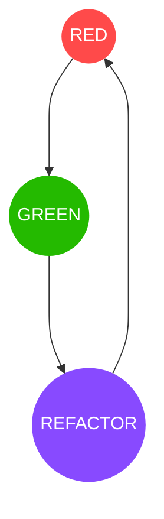

## Unit test
Unit tests are sefety net to catch bugs before they go to production.
They validate the positive and negative out come of a function.

Every unit tests should follow three steps: `setup`, `action` and `asser`.
```python
# Production code
def str_len(theStr):
    return len(theStr)

# Unit test
def test_str_len():
    testStr = "1"              // setup  - create a testing parameters
    result = str_len(testStr)  // action - call production code to perform test 
    assert result = 1          // assert - validates results of action 
```
## Test Driven Development(TDD)
TDD is a process where failing unit test is written before the production code.
It forces a well structured code, more test coverage and gives confidence to 
change the code.

It has three workflows: `RED`, `GREEN` and `REFACTOR`.

RED - write a failing unit test.
GREEN - write just enough production code to make that test pass.
REFACTOR - refactor the unit test and produciton code to make it clean.

> Repeat until the feature is complete.



## Uncle Bob's 3 laws of TDD 

- You may not write any production code until you have written a failing Unit
test.
- You may not write more of a unit test that is sufficient to fail.
- You may not write more production code that is sufficient to pass the current
failing unit test.

