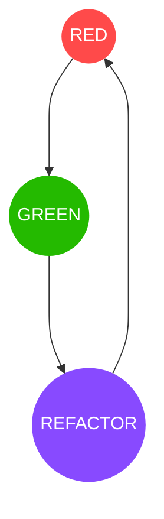

## Unit test
Unit tests are sefety net to catch bugs before they go to production.
They validate the positive and negative out come of a function.

Every unit tests should follow three steps: `setup`, `action` and `asser`.
```python
# Production code
def str_len(theStr):
    return len(theStr)

# Unit test
def test_str_len():
    testStr = "1"              // setup  - create a testing parameters
    result = str_len(testStr)  // action - call production code to perform test 
    assert result = 1          // assert - validates results of action 
```
## Test Driven Development(TDD)
TDD is a process where failing unit test is written before the production code.
It forces a well structured code, more test coverage and gives confidence to 
change the code.

It has three workflows: `RED`, `GREEN` and `REFACTOR`.

RED - write a failing unit test.
GREEN - write just enough production code to make that test pass.
REFACTOR - refactor the unit test and produciton code to make it clean.

> Repeat until the feature is complete.



## Uncle Bob's 3 laws of TDD 

- You may not write any production code until you have written a failing Unit
test.
- You may not write more of a unit test that is sufficient to fail.
- You may not write more production code that is sufficient to pass the current
failing unit test.

## PyTest

PyTest is a python unit testing framework. It uses built-in assert statement and
has command line parameters to help filter which test to execute and in what
order.

Tests are python function with prefix `test`. PyTest runs all files of the form
`test_*.py` or `*_test.py`. Similar test can be grouped in a `Test` prefixed
test class. Test classes should not contain `__init__` method. Each test 
methods in the class should be `test` prefixex.

### xunit-style setup/teardown

Pytest let you define setup/teardown test states for:
**Function level**: runs for every unit test in the same module 
```python
def setup_function(function)
    """setup any state tied to the execution of the given function.
    Invoked for every test function in the module.
    """

def teardown_function(function):
    """teardown any state that was previously setup with a setup_function
    call.
    """
```

**Module level**: runs once for all unit test in a module
```python
def setup_module(module):
    """ setup any state specific to the execution of the given module."""


def teardown_module(module):
    """teardown any state that was previously setup with a setup_module
    method.
    """
```

**Class level**: runs once for all unit test in a test class
```python
@classmethod
def setup_class(cls):
    """setup any state specific to the execution of the given class (which
    usually contains tests).
    """


@classmethod
def teardown_class(cls):
    """teardown any state that was previously setup with a call to
    setup_class.
    """
```

**Method level**: runs for every unit test in a test class 
```python
def setup_method(self, method):
    """setup any state tied to the execution of the given method in a
    class.  setup_method is invoked for every test method of a class.
    """


def teardown_method(self, method):
    """teardown any state that was previously setup with a setup_method
    call.
    """
```
